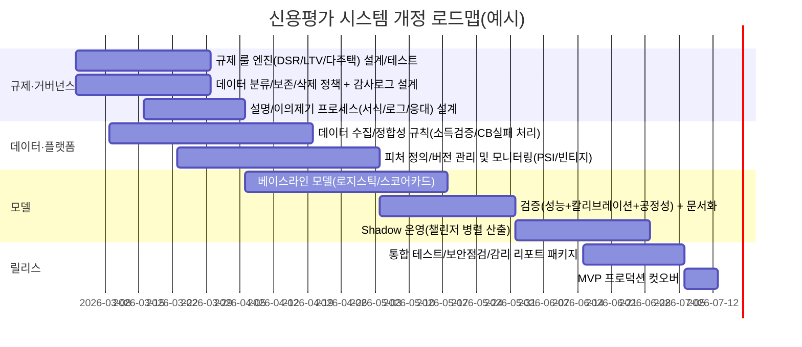

# 은행 신용평가 시스템 개발 계획 실무 검토·비평·개선 제안 보고서

## Executive Summary

본 보고서는 첨부된 “실무 검토 보고서(v1.1)”를 근거로, 해당 은행(가칭 KCS)의 **현실적 신용평가(신용심사/한도·금리산정/리스크·수익성 평가/운영·감사) 시스템 개발 계획**을 요약하고, 규제·데이터·모델·운영·보안·MLOps·일정/예산 측면에서 비평 및 개선안을 제시한다. 특히 사용자가 추가로 요청한 **모델의 신뢰성·안정성·수익성·건전성 평가 기준 수립, 검증 방법 정의, 그리고 (가능 범위 내) 검증 수행**을 별도 프레임으로 체계화하였다. fileciteturn0file0

핵심 결론은 다음과 같다.

첫째, 개발 계획은 “규제계산(DSR/LTV) + 신용평가(모델) + 운영/감사(로그) + 모니터링(PSI 등)”까지 **엔드투엔드 스코어링/디시저닝을 지향**한다는 점에서 방향성은 맞다. 다만 **규제 로직(특히 스트레스 DSR), 개인정보/신용정보 안전조치(고유식별정보 처리), 감사로그 신뢰성, 챔피언–챌린저 운영 방식**에서 실무·규제 요구 대비 “설계 수준의 빈틈”이 이미 다수 확인되었고, 이는 그대로 두면 **릴리스 지연·감리 지적·민원/분쟁·리스크 비용 증가**로 직결될 가능성이 높다. fileciteturn0file0

둘째, 규제 대응은 “문서에 규정값을 박아넣는 방식”이 아니라 **파라미터/버전 관리가 가능한 규제 룰 엔진(정책 테이블 + 효력일 + 지역/상품/금리유형 조건)**로 설계해야 한다. 스트레스 DSR은 2024~2026 기간 동안 단계별 적용대상·가중치·지역 차등·예외가 계속 조정되어 왔고, 2025-07-01 3단계 시행(기본 스트레스 금리 1.5% 관련)처럼 변동이 잦다. citeturn4view2turn15search2turn15search4turn15search15

셋째, 모델 검증(Validation)은 단지 AUC/PSI 체크가 아니라, **(a) 신뢰성(정확도+칼리브레이션+설명 일관성), (b) 안정성(드리프트+빈티지/코호트), (c) 수익성(리스크조정 수익, 가격·한도 정책과의 결합 성과), (d) 건전성(연체/부도·자본/충당·집중위험)**을 함께 보는 다층 프레임이 필요하다. 이는 국제적으로도 모델 리스크 관리 프레임(개발–검증–거버넌스)에서 표준적으로 요구되는 접근이다. citeturn10search0turn10search22turn1search2

넷째, “검증 수행” 관점에서 첨부 문서는 이미 **19개 이슈(Critical 6, Important 8, Minor 5)**를 식별했으며, 이는 곧 현 계획의 검증체계가 아직 **요건 정의/번호정합성/측정지표 구분(PSI 타입)/수익성(경제자본·EAD·CCF) 단순화** 등에서 불완전함을 의미한다. 본 보고서는 해당 이슈들을 “평가 기준–검증 방법–KPI”로 재매핑하여, **우선순위 개선 조치와 정량 KPI**로 전환하였다. fileciteturn0file0

우선순위(Top 5) 권고안은 다음과 같다.

- **P1**: 스트레스 DSR/LTV 등 규제 산식의 **버전·효력일·지역/상품 조건**을 파라미터화(룰/정책 테이블화)하고, 규정 변경시 회귀테스트(골든 케이스) 자동화. (Effort: High) citeturn4view2turn15search2turn17search4  
- **P2**: 고유식별정보(주민번호 등) 처리: 단순 해시(SHA-256) 금지, **키드 해시(MAC/HMAC) + 키관리(HSM/전용 KMS) + 접근통제/로그**로 재설계. (Effort: Medium–High) citeturn16search5turn6search2turn17search2turn17search19  
- **P3**: 감사로그: “0ms 비동기” 같은 낙관적 설계 금지. **유실 방지(at-least-once)·무결성 체인·5년 이상 보존 정책**을 설계에 명기. (Effort: Medium) citeturn17search4turn3search1  
- **P4**: 챔피언–챌린저: 실거래 고객을 대상으로 한 “직접 A/B”는 소비자 보호·운영리스크가 크므로 **Shadow 모드(의사결정은 챔피언, 챌린저는 병렬 산출·타당성 평가)**로 전환. (Effort: Medium) fileciteturn0file0  
- **P5**: 검증항목(DEV-xx) 번호/내용 불일치, PSI 정의 혼재, 빈티지 분석 후순위 등 **검증체계 거버넌스 자체의 정합성**을 먼저 바로잡고, 정식 Model Risk Management 문서(사용목적·한계·데이터·검증·승인·모니터링)를 산출물로 고정. (Effort: Medium) citeturn10search0turn10search22turn1search2  

## 첨부 개발 계획 요약과 전제

### 첨부 자료 기반 요약

첨부된 문서는 “개발 계획서 원문”이 아니라, **설계 문서(v1.0→v1.1)와 구현 코드 전수에 대한 실무 검토 결과**로 작성된 것으로 보인다. 따라서 본 보고서의 “개발 계획 요약”은 (i) 검토 문서가 직접 언급한 설계 요소와 (ii) 지적사항이 암시하는 설계·구현 방향을 재구성한 것이다. fileciteturn0file0

검토 문서로부터 확인되는 개발 계획의 골격은 다음을 포함한다.

- **규제·정책 계산**: 스트레스 DSR, LTV(규제지역 포함), 다주택자 규제 필드 등. fileciteturn0file0  
- **개인/소득 데이터 처리**: 근로자·자영업자 소득 검증 로직, CB 조회 처리(실패/대체), MyData 활용 가능성. fileciteturn0file0  
- **신용리스크/수익성 평가**: EAD 산정, 경제자본/리스크 가중치 반영, 수익성 테스트. fileciteturn0file0  
- **모델 운영**: 챔피언–챌린저, 검증 항목(DEV-xx), PSI, 빈티지 분석(권고). fileciteturn0file0  
- **보안/감사**: 주민번호 처리(해싱), 감사 로그의 저장 방식(동기/비동기), 역할 기반 접근 제어(RBAC). fileciteturn0file0  
- **구현 단계(Phase)**: 단계 순서가 명시되며, 통합 테스트와 감독당국 보고서 자동생성 간 순서 문제가 지적됨. fileciteturn0file0  

### 누락 정보와 본 보고서의 가정

개발 계획서 원문(요구사항 정의서/아키텍처 다이어그램/데이터 사전/모델링 상세/예산·일정표)이 첨부되지 않아, 아래는 본 보고서가 분석·제안을 위해 둔 가정이다(추후 원문 제공 시 재산정 필요).

- 대상은 **가계대출(주담대+신용대출+기타)**을 포함한 개인 여신 심사로 가정(스트레스 DSR 단계 적용 대상이 해당 방향으로 전개되어 왔기 때문). citeturn4view2turn15search2  
- “점수 300~900” 등의 스코어 범위 요구가 존재한다고 가정(검증 항목으로 언급됨). fileciteturn0file0  
- 모델은 최소 1개 이상(챔피언–챌린저 전제)이며, 운영단에서 PSI 등 드리프트 모니터링을 수행하려는 것으로 가정. fileciteturn0file0  
- 감사로그는 신용평가/자동화평가에 대한 **이력 보존**과 연결되며(최소 5년 수준), 또한 전자금융·개인정보 시스템 로그 보존 의무도 고려해야 함. citeturn3search1turn17search4turn6search2  
- MyData를 “직접 영위”하는 구조인지(은행이 본인신용정보관리회사 역할) 또는 “은행이 MyData 데이터를 수신해 활용”하는 구조인지 불명확하므로, 양 경로의 컴플라이언스 요구를 모두 제시한다. citeturn1search3turn6search6  

## 규제·거버넌스·소비자보호 관점 비평

이 절은 국내 법·감독규정 및 국제적 준거를 “개발 계획의 기능 요구사항”으로 환산해 평가한다. 국내 준거기관으로는 entity["organization","금융위원회","financial regulator, kr"], entity["organization","금융감독원","supervisory service, kr"], entity["organization","개인정보보호위원회","privacy regulator, kr"], entity["organization","한국인터넷진흥원","kisa, kr"], entity["organization","금융보안원","financial security institute, kr"] 자료·규정을 주로 참고하며, 국제 준거로는 entity["organization","Bank for International Settlements","basel, ch"] 산하 entity["organization","Basel Committee on Banking Supervision","bcbs, basel"], entity["organization","European Banking Authority","eba, eu"], entity["organization","Federal Reserve","us central bank"] 및 entity["organization","Office of the Comptroller of the Currency","us bank regulator"]의 모델 리스크 가이던스를 참조했다. citeturn10search0turn10search16turn1search2  

### 규제준수

스트레스 DSR은 단계별 적용 범위와 산정 방식이 정책적으로 변화해 왔고, 2024년 2단계 시행(9월), 2025년 7월 3단계 시행 등 “시행 시기/대상/가중치/지역”이 빈번히 조정되었다. 따라서 단순히 “현행금리 + 1.5%p” 같은 정적 문구만으로는 규제 준수 구현이 불가능하며(검토 문서도 이 지점을 Critical로 지적), 룰의 파라미터화와 회귀테스트 자동화가 필수다. fileciteturn0file0 citeturn4view2turn15search2turn15search15  

규제 준수 관점에서 “실무 검토 문서”가 이미 특정한 핵심 결함은 (i) 스트레스 DSR 로직의 구체화 누락, (ii) 다주택자 규제 필드 누락, (iii) LTV 규제지역의 동적 관리 필요 등으로 요약된다. 이는 “규제 계산이 시스템의 신뢰성/합법성의 바닥”임을 고려하면, 데이터/모델보다 먼저 고쳐야 하는 항목이다. fileciteturn0file0

### 개인정보·신용정보 거버넌스

개인정보보호법은 개인정보 처리자에게 안전조치 의무를 부과하고(제29조), 민감정보·고유식별정보 처리 제한 및 암호화 등 안전조치를 요구한다(제23조, 제24조). 특히 주민등록번호는 고유식별정보로서 법적 근거 또는 별도 동의 등 요건을 충족해야 하며, 처리 시 암호화 등 안전조치가 요구된다. citeturn6search2turn16search5turn16search13turn17search19  

첨부 검토 문서는 주민번호를 단순 SHA-256 해시로 처리한 점을 “취약”으로 지적한다. 이는 (a) 고유식별정보 안전조치(암호화 포함) 요구와 충돌할 수 있고, (b) 해시를 쓰더라도 “솔트/키드 해시” 등 안전한 방식이 요구될 수 있으며, (c) 키 관리체계까지 포함한 설계가 필요하다는 점을 보여준다. 가명정보 처리 가이드라인은 해시를 “키가 없는 해시/솔트 해시/키가 있는 해시(MAC)”로 구분하여 설명하고 있어, 최소한 키드 해시(HMAC 등)로의 전환 논리를 뒷받침한다. fileciteturn0file0 citeturn17search2turn16search5turn6search2  

또한 신용정보법은 상거래 종료 후 개인신용정보 삭제(최장 5년) 등 보유기간 원칙을 규정하며, 시스템은 “필요 최소 보유 + 합법적 예외 + 삭제/파기”가 설계에 들어가야 한다. citeturn3search1turn3search15  

### 자동화평가 설명·이의제기와 소비자 고지

신용평가 시스템이 자동화평가를 수행한다면, 소비자(신용정보주체)는 자동화평가 결과·기준·기초정보 등에 대한 설명 요구 및 이의제기/정정·삭제·재산출 요청이 가능한 구조가 제도적으로 정착돼 있다(하위법령·서식에서도 구체화). 따라서 설명가능성은 “기술 옵션”이 아니라, **업무프로세스·UI/문서·로깅/추적성**까지 포함한 필수 요구사항으로 취급해야 한다. citeturn13search0turn12search1turn14search0  

또한 금융상품 판매 과정에서는 설명의무가 법으로 규정되어 있고(금융소비자보호법 제19조), 금융위는 설명의무 이행을 소비자 친화적으로 개선하기 위한 가이드라인 논의도 진행해 왔다. 신용평가 시스템이 “승인/거절/금리·한도”에 영향을 주는 이상, 모델 출력(점수)만으로 끝나지 않고 “중요사항 설명”을 지원하는 정보 설계가 필요하다. citeturn0search16turn0search28  

### AI/ML 공정성·책임성

금융분야 AI 가이드라인은 내부통제(윤리원칙–전담조직–위험관리정책), 데이터 정확성·안전성, 공정성 제고(불합리한 차별 방지), 소비자 설명 및 권리 보장을 핵심가치로 제시했다. 이는 신용평가 시스템이 ML을 쓰든 안 쓰든 “자동화된 평가”로서 준수해야 할 기대수준을 정의한다. citeturn4view3turn1search4  

따라서 개발 계획에서 “챔피언–챌린저 직접 A/B”처럼 고객에게 다른 신용결정을 실시간으로 적용하는 방식은 공정성·분쟁·내부통제 측면에서 부담이 크며, 최소한 Shadow 운영으로 전환하는 것이 합리적이다(검토 문서도 Critical로 분류). fileciteturn0file0  

국제적으로도 모델 리스크 관리는 “개발–검증–거버넌스”의 3요소를 강조하며, 특히 검증은 독립성, 문서화, 한계 인지, 사용 적합성 점검이 핵심이다. citeturn10search0turn10search16  

## 데이터·모델 검증 체계

이 절은 사용자가 요청한 “신뢰성·안정성·수익성·건전성 평가 기준 수립–검증 방법–검증 수행”을 추진 가능한 형태로 정리한다. “검증 수행”은 (a) 첨부 문서에 근거한 **현 계획의 검증체계 결함을 식별·분류하는 ‘설계 검증’**과 (b) 실제 운영데이터가 있을 때 수행해야 할 **‘데이터 기반 실증 검증’**으로 나누어 제시한다(원천 데이터/모델 아티팩트가 첨부되지 않아 (b)는 실행 절차와 산출물 정의까지 수행). fileciteturn0file0  

### 평가 기준 정의

아래 정의는 “어떤 모델(통계/ML/하이브리드든)”에도 공통 적용되며, 은행 실무에서 리스크/수익/건전성을 한 프레임으로 묶어 관리하기 위한 최소 세트다. 모델 리스크 관리 가이던스는 이러한 체계를 정책·통제 아래 운용할 것을 요구한다. citeturn10search0turn10search22  

**신뢰성(Reliability)**은 “맞추는가”에 더해 “그 확률/점수가 의미하는 바가 일관되게 유지되는가(칼리브레이션)”까지 포함한다. 성능(AUC 등)과 확률정확도(Brier 등)는 서로 다른 속성이며, 금융 의사결정(승인/거절/한도/가격)은 확률/손실 추정에 민감하므로 칼리브레이션을 분리 측정해야 한다. citeturn9search2turn9search3turn9search1  

**안정성(Stability)**은 데이터 분포 변화(드리프트)가 모델 출력과 성능을 훼손하지 않는지, 그리고 코호트(빈티지)별로 성능이 일관적인지를 본다. 리스크 데이터의 정확·일관 집계와 보고는 은행 리스크관리의 핵심 원칙으로, 데이터 거버넌스 관점에서도 안정성은 독립 KPI로 관리되어야 한다. citeturn1search2turn10search22  

**수익성(Profitability)**은 “모델이 잘 맞는다”와 별개로, **정책(DSR/LTV)·가격(금리)·한도**와 결합된 결과가 순이익/리스크조정 수익으로 이어지는지를 본다. 여신 의사결정은 분류 문제이면서 동시에 최적화 문제이며, 신용스코어링 연구에서도 비용/성과 지표를 함께 고려해야 함이 반복적으로 강조돼 왔다. citeturn8search4turn8search5turn10search1  

**건전성(Soundness)**은 포트폴리오 품질(연체·부도)과 자본/충당(예: ECL 산식 상 PD·LGD·EAD) 및 집중위험/스트레스 결과가 “은행의 리스크 감내한도(Risk Appetite)”에 부합하는지 평가한다. 내부등급법(IRB) 및 내부등급시스템 검증 연구는 “등급이 리스크를 충분히 구분하는가, 추정치가 적절한가”를 핵심으로 다룬다. citeturn10search22turn10search2turn10search11  

### KPIs·검증 방법·개발 계획 반영 여부

아래 표는 평가 기준별로 “권고 KPI/임계치 예시–검증 방법–현재 계획에서 확인된 반영 수준–우선 보완”을 요약한다. 임계치는 은행의 상품/포트폴리오/리스크 성향에 따라 달라야 하며, 본 표의 수치는 “시작점(초안)”으로 제시한다.

| 평가축 | 권고 KPI(예시) | 권고 임계치(예시) | 핵심 검증 방법 | 현재 계획 반영(첨부 기반) | 우선 보완 포인트 |
|---|---:|---:|---|---|---|
| 신뢰성 | ROC-AUC, KS, PR-AUC | AUC ≥ 0.75 (상품별), KS ≥ 0.35 | OOT(Out-of-Time) 홀드아웃, 부트스트랩 CI, DeLong 검정(챔피언 vs 챌린저) | 성능·PSI 항목은 있으나 검증번호 불일치로 체계 신뢰도 훼손 | 검증항목 체계(카탈로그) 정리 + OOT 고정 |
| 신뢰성 | Brier score, ECE, 캘리브레이션 슬로프/인터셉트 | Brier ≤ 기준선 대비 개선, ECE ≤ 0.02 | Reliability diagram, Platt/Isotonic 보정 비교 | 구체 언급 없음 | 확률기반 의사결정이면 “칼리브레이션”을 필수 KPI로 추가 |
| 안정성 | PSI(Score), PSI(Feature), Drift rate | 경고 0.1 / 위험 0.2 등 정책화 | 월별/주별 분포 비교, 코호트/지역/상품별 분해 | PSI 타입 구분 불명확 지적 | PSI 정의 분리(Score/Feature/Target) + 액션 룰 |
| 안정성 | 빈티지(코호트) 누적부도율/연체율 | 초기 3·6·12개월 추적 | Vintage curve, 롤레이트(roll-rate) | 빈티지 분석 우선순위 상향 권고 | 모니터링 KPI의 “핵심”으로 승격 |
| 수익성 | 기대이익(순이자–EL–비용), RAROC | 타깃 RAROC(내부 기준) | 정책/가격/한도 시뮬레이션, 정책 비교(기존 vs 신규) | 수익성 테스트는 있으나 EAD 단순화(=대출액), 경제자본에 RW 미반영 | 상품유형별 EAD/CCF, RW/자본정책 연결 |
| 건전성 | 30/60/90+ DPD, NPL, PD backtest | 리스크 성향 기반 | 등급별 부도율 단조성, 컷오프 민감도, 스트레스 시나리오 | 스트레스 DSR 로직 미구체화(치명), 다주택자 필드 누락 | 규제룰 엔진화 + 골든 케이스 검증 |

신뢰성 지표 중 AUC 비교는 DeLong 방법(상관된 ROC 비교)을 활용해 챔피언/챌린저의 유의 차이를 판단할 수 있다. citeturn9search3  
칼리브레이션은 Brier score(확률예측의 정합성) 및 Platt scaling 같은 보정 기법을 통해 평가·개선할 수 있다. citeturn9search2turn9search1  
신용스코어링 알고리즘 선택에 따른 성능-해석가능성 트레이드오프는 다수 연구에서 비교되어 왔으며, 전통적 분류기 리뷰 및 대규모 벤치마크 연구가 존재한다. citeturn8search4turn8search5  

### 검증 수행 결과

#### 설계·코드 정합성 기반 검증

첨부 문서는 이미 “검증 체계가 스스로의 신뢰성을 훼손하는” 문제를 지적한다. 예를 들어 검증 항목(DEV-12/13 등)의 **설계 문서와 테스트 코드가 서로 다른 내용을 검사**하면, CI가 통과해도 “무엇이 검증됐는지”가 불명확해져 감사/검사/모델승인에서 치명적이다. 이는 신뢰성 축의 ‘메타-검증(Validation governance)’ 실패로 분류해야 한다. fileciteturn0file0  

또한 PSI 관련해서도 “무엇의 PSI인지(Score/Feature/Target)”가 불명확하면, 드리프트 대응(재학습/정책조정/데이터 이슈)을 정확히 유도할 수 없다. 이는 안정성 축의 ‘탐지-대응’ 체인이 끊기는 문제다. fileciteturn0file0  

수익성/건전성에 대해서는 EAD를 단순히 대출액으로 놓거나(회전대출/한도상품 미반영), 경제자본 계산에 리스크가중치가 빠지는 등 “경영지표로서의 사용가능성”을 떨어뜨리는 단순화가 확인된다. 이는 모델 자체 성능과 별개로, **비즈니스 의사결정(가격/한도/포트폴리오)에서 잘못된 최적화**를 유발할 수 있다. fileciteturn0file0  

마지막으로 스트레스 DSR은 규제 준수의 핵심인데도 구체 산식/단계 반영이 누락되어 “규제 위반 위험”으로 직결된다. 실제로 3단계 스트레스 DSR은 적용 대상과 유예/예외가 존재하며(예: 신용대출 잔액 1억 초과 조건 등), 2026년 상반기 운영방안처럼 지역별 조정도 논의·시행돼 왔다. 이를 파라미터화하지 않으면 릴리스 시점에 바로 낙오한다. fileciteturn0file0 citeturn15search2turn15search15  

#### 데이터 기반 실증 검증

실제 검증을 수행하려면 최소한 아래 아티팩트가 필요하다: (1) 학습/검증/운영 데이터 샘플(비식별 또는 안전조치된), (2) 라벨 정의(부도/연체 기준과 관측 윈도우), (3) 모델 스코어/확률 출력, (4) 정책 룰(DSR/LTV/다주택 등) 및 결과(승인/거절/한도/금리), (5) 손익 요소(금리, 수수료, 손실, 비용). 이는 모델 리스크 관리에서 “목적–데이터–방법–결과–한계”를 문서화하라는 요구와 정합적이다. citeturn10search0turn10search22  

본 보고서는 데이터가 미제공된 상태이므로, 아래 “실증 검증 패키지”를 **재현 가능한 실험 설계 + 산출물(차트/리포트) 정의**까지 제공한다(실행은 은행 내부 데이터로 즉시 가능).

- Experiment A: **OOT 성능(신뢰성)**
  - 설계: T-12개월 학습, 최근 3개월 OOT, 상품/채널/지역별 분해.
  - 산출물: ROC, PR curve, KS, DeLong test(챔피언 vs 챌린저). citeturn9search3  
- Experiment B: **칼리브레이션(신뢰성)**
  - 설계: 캘리브레이션 셋을 별도 분리, Platt vs Isotonic 비교.
  - 산출물: Reliability diagram(10분위), Brier score, ECE. citeturn9search2turn9search1turn9search8  
- Experiment C: **드리프트(안정성)**
  - 설계: 월별 Score PSI vs Feature PSI 분리, 경고/위험 임계치 정책화.
  - 산출물: PSI 추이 그래프, 원인 Top feature drift 리포트. (PSI 정의 분리 필요는 첨부 지적사항 기반) fileciteturn0file0  
- Experiment D: **빈티지/롤레이트(안정성·건전성)**
  - 설계: 실행월 코호트별 3/6/12개월 누적 연체율·부도율, 롤레이트 매트릭스.
  - 산출물: Vintage curve, Roll-rate heatmap. (빈티지 우선순위 상향 권고는 첨부 기반) fileciteturn0file0  
- Experiment E: **정책·가격 결합 수익성(수익성)**
  - 설계: “기존 정책+기존 모델” vs “개선 모델+정책(동일)” vs “개선 모델+정책 최적화” 시나리오.
  - 산출물: 승인율, 기대손실(EL=PD×LGD×EAD), 순이익, RAROC(내부 정의). citeturn10search11  
- Experiment F: **공정성/차별 점검(신뢰성·거버넌스)**
  - 설계: 보호속성(법적·윤리적으로 허용되는 범위 내) 또는 대리변수에 대해 Equal Opportunity gap 등 측정.
  - 산출물: 그룹별 TPR/FPR 차이, threshold 민감도. citeturn8search7  

##### 예시 ROC/AUC 및 캘리브레이션 플롯

아래는 “차트 형태 예시”를 설명으로 제공한다(실데이터 산출물은 위 실험 설계로 생성).

- ROC: x축 FPR(0→1), y축 TPR(0→1). 챔피언(실선)은 AUC 0.78, 챌린저(점선)는 AUC 0.81로 더 위에 위치하며, DeLong 검정 p<0.05면 통계적으로 우월. citeturn9search3  
- Calibration: 10분위로 예측확률을 자르고, 각 분위의 평균 예측확률과 실제 부도율을 점으로 찍는다. 이상적이면 y=x 대각선에 붙는다. 과신(Overconfidence) 시 점이 대각선 아래로 내려가며, Platt scaling 적용 후 점들이 대각선에 가까워지는지 비교한다. citeturn9search1turn9search2  

## 기술 아키텍처·보안·MLOps 비평

### 인프라·MLOps

챔피언–챌린저 운영은 성능 개선에 유용하지만, 금융에서 실거래 의사결정에 직접 A/B로 적용하면 운영리스크(민원·분쟁·설명 불일치·내부통제)가 커진다. 모델 리스크 관리 관점에서도 새 모델은 충분한 검증과 승인 하에 제한적으로 적용되어야 하며, Shadow 모드가 표준적 절충안이다. fileciteturn0file0 citeturn10search0  

또한 감사로그의 “비동기 0ms 저장”은 로깅 유실 가능성을 키우며, 신용평가/자동화평가 시스템은 사후 추적가능성(누가/언제/무엇을 근거로)을 핵심 통제로 요구한다. 전자금융감독규정은 중요원장에 대한 직접 접근·변경 시 작업자/작업내용을 5년 보존하도록 요구하는 조항을 포함하고 있어, 최소한 **상응 수준의 접근기록·감사로그 보존 정책**이 필요하다. fileciteturn0file0 citeturn17search4  

MLOps 관점에서는 최소한 다음이 “필수 운영 구성요소”다: 모델 레지스트리(버전/승인상태/승인자), 피처 스토어 또는 피처 정의의 단일화, 모델/데이터 드리프트 탐지와 대응 런북, 재학습 파이프라인의 재현성. 이는 데이터 집계/보고의 정확성과 적시성을 강조하는 원칙(리스크 데이터 거버넌스)과도 정합된다. citeturn1search2turn10search0  

### 보안·프라이버시

개인정보보호법은 안전조치 의무(제29조)를 규정하고, 안전성 확보조치 기준 고시 등 하위규범으로 접근통제·암호화·로그관리 등의 세부 요구를 둔다. citeturn6search2turn17search19  

주민등록번호는 고유식별정보로서 처리 제한 및 암호화 등 안전조치가 요구된다. 따라서 주민번호를 식별키로 쓴다면 “단순 해시”가 아니라 **키드 해시(HMAC 등) + 키관리 + 접근통제 + 감사로그**를 설계에 포함하는 것이 안전하다. 가명정보 처리 가이드라인도 키가 있는 해시(MAC)를 명시적으로 언급한다. citeturn16search5turn17search2turn17search19  

또한 신용정보법의 개인신용정보 삭제(최장 5년) 원칙은 로그/이력 설계(보관·삭제·가명화)와 충돌할 수 있으므로, “법적 보존 의무가 있는 기록 vs 삭제 대상”을 데이터 분류 체계로 나누어 관리해야 한다. citeturn3search1turn3search15  

해외 규제 관점에서, EU GDPR은 자동화된 의사결정(프로파일링 포함)으로 법적·중대한 영향을 주는 경우 제한 및 권리(인간 개입, 이의제기 등)를 규정한다. 브라질 LGPD도 자동화된 의사결정에 대한 재검토 요청권을 규정한다. 국내 시스템이 해외 거주자를 대상으로 서비스를 확장하거나 해외 데이터 처리(클라우드/공동모델) 가능성이 있다면, “설명/이의제기 프로세스”는 국제적으로도 방어적 설계가 된다. citeturn11search0turn11search1  

정보보호 관리체계 관점에서 ISMS-P 인증기준은 관리체계 수립/운영, 보호대책 요구사항, 개인정보 처리 단계별 요구사항으로 구성됨을 밝히고 있어, 은행이 내부통제/감리 대응을 고려한다면 이를 운영 체크리스트로 활용할 수 있다. citeturn11search3turn11search7  

## 개정 구현 로드맵과 자원·예산 현실성

### 개정 로드맵 원칙

로드맵의 핵심 원칙은 “모델보다 규제·데이터·감사(추적성)가 먼저”다. 첨부 문서에서 Critical로 분류된 항목들이 실제로는 **릴리스 게이트(Go/No-Go)** 성격을 가지기 때문이다. fileciteturn0file0  

또한 단계 순서(Phase)에서 “통합 테스트 이전에 감독당국 보고서 자동생성”이 배치된 점은, 테스트 미완료 산출물이 대외 문서에 반영될 위험을 키우므로 순서 재배치가 합리적이다. fileciteturn0file0  

### 제안 일정

원문 일정/예산이 미제공이므로, “은행권 현실”을 반영한 **2트랙 일정**을 제안한다.

- **트랙 A (MVP, 6개월)**: 규제룰 엔진 + 데이터 품질/거버넌스 + 베이스라인(로지스틱/스코어카드) + 로깅/권한 + Shadow 검증 체계 구축.
- **트랙 B (확장, 6~12개월 추가)**: 고도화(GBDT 등), 가격/한도 최적화, MyData/외부데이터 확장, 자동 리포팅/감리 대응 패키지.

아래 Mermaid Gantt는 권고 일정 예시다(실제 인력/데이터 접근성에 따라 변동).



### 필요 역할과 책임(RACI 요약)

- 리스크 정책(DSR/LTV/다주택/상품별 예외): **업무 오너**, 규제 변경 대응 책임. citeturn15search2turn15search15  
- 준법/개인정보: 고유식별정보 처리, 보유·삭제, 설명/이의제기 프로세스 적정성 검토. citeturn6search2turn3search1turn13search0  
- 데이터 엔지니어링: 수집·정합성·계보(lineage), 품질 룰, 재현 가능한 피처 파이프라인. citeturn1search2  
- 데이터 사이언스/모델러: 모델 개발·검증·문서화, 칼리브레이션/드리프트 대응. citeturn10search0turn9search2turn8search5  
- MLOps/플랫폼: 모델 레지스트리, 배포, 모니터링 자동화, Shadow 운영 구조. citeturn10search0  
- 보안/인프라: 키관리, 접근통제, 로그 보존, 취약점 점검, ISMS-P 대응. citeturn16search5turn11search3turn17search4  
- 현업 심사/영업: 설명가능성(거절 사유/보완자료) UX 검증, 운영 시나리오 테스트. citeturn0search16turn13search0  

### 예산 현실성

예산은 (i) 인력(FTE), (ii) 외부데이터 비용(CB/MyData/감정평가/소득 연계), (iii) 보안(키관리/HSM, 로깅 스토리지, 취약점 진단), (iv) 인프라(모델 서빙/모니터링), (v) 감리·문서화 비용으로 구성된다. 특히 MyData를 직접 영위하거나 전송요구권 체계를 연계하는 경우, 허가/요건과 보안/물적 설비 요구가 추가되므로 일정·비용 변동성이 커진다. citeturn1search3turn6search6  

원문 예산이 없으므로 “현실적인 범위”만 제시하면, MVP 6개월 트랙은 최소 8~12명 규모(리스크/준법/데이터/모델/MLOps/보안 포함)의 전담이 필요하고, 확장 트랙까지 포함하면 12~18명 규모로 증가하는 것이 일반적이다(외부 SI 포함 여부에 따라 총비용은 크게 변동). 이 항목은 내부 인건비/외주 단가/보안 인프라 성숙도에 따라 산정되어야 한다.

## 부록: 모델 대안 비교, 리스크 레지스터, 우선 조치 목록 및 Mermaid 흐름도

### 대안 모델 접근법 비교

신용스코어링에서 로지스틱 회귀/스코어카드는 해석가능성과 운영 적합성으로 널리 사용되어 왔고, 이후 앙상블/부스팅 등 더 복잡한 모델이 성능을 개선할 수 있음이 벤치마크 연구에서 반복적으로 확인된다. 다만 금융에서는 설명/거버넌스 요구가 강하므로 “성능만”으로 결론내리기 어렵다. citeturn8search4turn8search5  

| 접근법 | 장점 | 단점/리스크 | 데이터 요구 | 설명가능성/소비자 고지 | 예상 성능 트레이드오프 |
|---|---|---|---|---|---|
| 로지스틱 회귀(스코어카드/WOE) | 규제·감사 친화, 안정적, 캘리브레이션 비교적 양호 | 비선형/상호작용 포착 한계 | 중간 | 높음(계수/WOE/Reason code) | 기준선(안정적) citeturn8search4turn9search2 |
| 규제화 로지스틱(Elastic Net) | 변수선택, 과적합 완화 | 설명은 가능하나 변수선정 논리 필요 | 중간 | 높음 | 기준선 대비 소폭 개선 가능 citeturn10search0 |
| GBDT(Gradient Boosting; LightGBM/XGBoost류) | 강한 예측력, 비선형/상호작용 자동 포착 | 확률 과신/칼리브레이션 저하 가능, 운영 복잡 | 중~대 | 중간(SHAP 등 필요) | AUC 등 랭킹 성능 개선 가능 citeturn8search5turn8search6turn9search1 |
| 신경망(MLP 등) | 대규모 데이터에서 성능 잠재력 | 설명·감리 부담, 안정성/재현성 관리 난이도 | 대 | 낮~중(XAI 필요) | 일부 케이스에서만 유의미 citeturn8search5turn8search6 |
| 하이브리드(룰+스코어카드+GBDT) | 규제/정책 룰과 ML의 장점 결합, 단계적 도입 용이 | 결합부(룰 충돌/우선순위) 설계 필요 | 중~대 | 중~높(룰+SHAP) | 실무 최적 절충안이 되는 경우 많음 citeturn10search0turn4view3 |

설명가능성 도구로 SHAP은 통일된 프레임을 제시하며, 복잡 모델의 로컬/글로벌 설명에 널리 사용된다. citeturn8search6  

### 리스크 레지스터

| 리스크 | 가능성 | 영향 | 조기징후(KRI) | 완화/대응 |
|---|---:|---:|---|---|
| 스트레스 DSR 산식/단계 반영 누락으로 규제 위반 | 높음 | 매우 높음 | 규정 변경 시 수동 수정, 테스트 부재 | 룰 엔진화 + 효력일 버전 + 골든케이스 회귀테스트 citeturn15search2turn15search15 |
| 주민번호 등 고유식별정보 처리 취약(단순 해시 등) | 중~높음 | 매우 높음 | 키관리 부재, 접근통제 미흡 | 키드 해시 + 키관리 + 접근·조회 로그 + 고시 준수 citeturn16search5turn17search2turn17search19 |
| 감사로그 유실(비동기/장애)로 사후 추적 불가 | 중~높음 | 높음 | 로그 공백, 이벤트–DB 불일치 | at-least-once, 무결성 체인, 보존정책(5년+) citeturn17search4turn3search1 |
| 챔피언–챌린저 직접 A/B로 민원/차별 이슈 | 중 | 높음 | 거절 사유 불일치, 고객 이의 제기 증가 | Shadow 운영, 사전 승인, 통제된 롤아웃 citeturn10search0turn4view3 |
| PSI 정의 불명확으로 드리프트 대응 실패 | 중 | 중~높음 | 경보는 뜨나 원인·대응 불명확 | Score/Feature/Target PSI 분리, 대응 룰북 fileciteturn0file0 |
| EAD/CCF 단순화로 수익성·건전성 판단 오류 | 중 | 중~높음 | 기대손실 과소/과대, 가격 왜곡 | 상품별 EAD/CCF 정책화, 검증 시나리오 추가 citeturn10search11 |
| 자동화평가 설명/이의제기 프로세스 미비 | 중 | 높음 | 설명요구 처리 지연/불완전 | 서식·로그·재산출 프로세스 내재화 citeturn13search0turn12search1 |
| MyData/외부데이터 도입 일정 지연 | 중 | 중 | 계약/허가/보안심사 지연 | 범위 분리(MVP는 내부데이터), 단계적 확장 citeturn1search3turn6search6 |

### 우선순위 액션 리스트

아래는 “실행 가능한 최소 단위(구체 작업)”로 쪼갠 권고안이며, 각 항목에 Effort(낮음/중간/높음)과 KPI를 부여했다.

| 우선순위 | 액션 | Effort | 추천 KPI(정량) |
|---:|---|---|---|
| P1 | 스트레스 DSR/LTV/다주택 규제 룰 엔진(정책테이블+효력일+지역/상품 조건) 구축 | 높음 | 규제 골든케이스 테스트 커버리지 ≥ 95%, 규정변경 반영 리드타임 ≤ 5영업일 citeturn15search2turn15search15 |
| P2 | 고유식별정보 처리: 키드 해시(HMAC/MAC) + 키관리(KMS/HSM) + 접근통제 | 중~높음 | 고유식별정보 평문 저장 0건, 키 회전(rotate) 수행률 100% citeturn16search5turn17search2 |
| P3 | 감사로그 at-least-once 저장 + 무결성(체인/서명) + 5년 보존 정책 | 중간 | 로그 누락률 0, 감사조회 응답 SLA(예: P95 < 2s) citeturn17search4turn3search1 |
| P4 | 챔피언–챌린저 Shadow 전환 + 승인 게이트(모델위원회) | 중간 | Shadow 기간 OOT 성능/칼리브레이션 리포트 100% 제출, 무승인 모델 실적반영 0건 citeturn10search0 |
| P5 | 검증 항목 카탈로그(DEV-xx) 재정의: 정의/데이터/계산/임계치/조치 룰 문서화 | 중간 | 검증 항목-테스트 코드 정합성 100%, 감사 지적 0건 fileciteturn0file0 |
| P6 | PSI 정의 분리(Score/Feature/Target) 및 드리프트 대응 룰북 운영 | 중간 | PSI 경보 후 RCA 완료 ≤ 10영업일, 불필요 재학습 비율 감소 fileciteturn0file0 |
| P7 | 빈티지 분석/롤레이트 모니터링을 운영 KPI 1순위로 채택 | 중간 | 월간 빈티지 리포트 발행률 100%, 조기경보 적중률(내부정의) fileciteturn0file0 |
| P8 | EAD/CCF, 경제자본 산식 개선(상품유형별 파라미터) | 중간 | EL/손익 예측오차(MAPE) 감소, 자본지표 변동성 통제 citeturn10search11 |
| P9 | 자동화평가 설명/이의제기 처리 프로세스 내재화(서식/재산출/로그) | 중간 | 설명요구 처리기한 준수율 100%, 민원 재발률 감소 citeturn13search0turn12search1 |
| P10 | RBAC(역할 기반 접근제어) 및 운영자/심사자/감사자 권한 분리 | 중간 | 권한 오남용 사고 0, 권한검토(quarterly) 수행률 100% fileciteturn0file0 |

### Mermaid 흐름도

아래 흐름은 “규제/정책 룰 + 모델 + 가격/한도 + 설명/로그 + 모니터링”을 하나의 디시저닝 파이프라인으로 정리한 권고 구조다(규제 산식 변동이 잦으므로 룰 엔진화가 핵심). citeturn15search2turn10search0  

```mermaid
flowchart TD
    A[신청/조회 요청] --> B[데이터 수집<br/>내부+외부(CB/MyData)]
    B --> C[데이터 품질·정합성 검사]
    C -->|Fail| C1[보완요청/대체경로/수동심사]
    C -->|Pass| D[규제·정책 룰 엔진<br/>(DSR/LTV/다주택/예외)]
    D -->|Hard cut| D1[거절 + 설명/이의제기 안내]
    D -->|Eligible| E[모델 스코어링<br/>(챔피언)]
    E --> F[가격·한도 산정<br/>(EL·수익성 포함)]
    F --> G[승인/조건부/거절 결정]
    G --> H[설명가능성 출력<br/>(주요 기준/기초정보 개요)]
    G --> I[감사로그 저장<br/>(무결성/보존)]
    E --> J[챌린저 Shadow 산출]
    J --> K[모니터링<br/>(PSI/빈티지/공정성/칼리브레이션)]
    K --> L[재학습/정책조정/데이터 개선]
```

